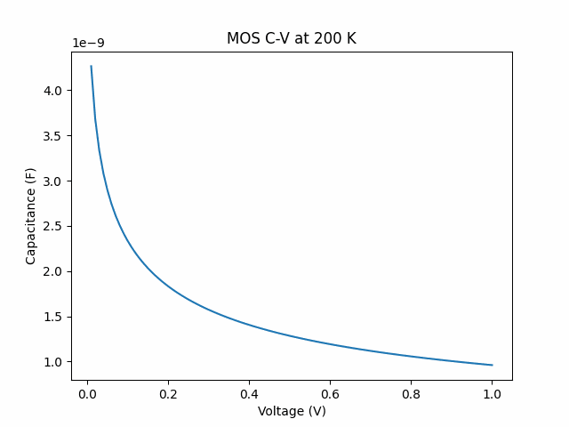

# MOS Capacitor C–V Simulator  

### Physics-Based Semiconductor Device Modeling Project

> A modular and testable scientific simulation framework for MOS capacitor analysis.


A scientific Python project for simulating **Capacitance–Voltage (C–V) characteristics** of a Metal-Oxide Semiconductor (MOS) capacitor, including **temperature-dependent semiconductor effects**.

This project is designed with research-level clarity, modular physics implementation, and reproducible numerical simulations.

---

## Project Overview


---
## Scientific Motivation

MOS capacitors are fundamental building blocks in semiconductor devices, 
including MOSFETs and CMOS technology. Understanding capacitance–voltage 
(C–V) characteristics is essential for:

- Doping profile extraction
- Oxide quality analysis
- Interface trap characterization
- Semiconductor device design

This project implements a simplified but physically meaningful 
MOS capacitor model for educational and research purposes.

##  Features

- **Oxide capacitance** calculation
- **Semiconductor depletion capacitance** modeling
- Simulate **total MOS capacitance (series combination)**
- **temperature-dependent** intrinsic carrier concentration
- Modular physics-based implementation
- Scientific visualization of MOS behaviour
### Generated Plots:
  - Intrinsic carrier concentration vs temperature
  - C–V characteristics at fixed temperature
  - C–V curves at multiple temperatures

---

## Project Structure

```
moscap-cv-simulator/
│
├── src/                 # Core physics modules
│   └── physics/
│       ├── moscap.py
│       ├── semiconductor.py
│       └── constants.py
│
├── examples/            # Simulation scripts
│   ├── cv_simulations.py
│   ├── cv_temperature.py
│   └── plot_intrinsic_carrier.py
│
├── tests/               # Unit tests
│   └── test_moscap.py

├── figures/
├── requirements.txt
└── README.md
```

---

##  Installation

### Clone the repository:

```bash
git clone https://github.com/YOUR_USERNAME/moscap-cv-simulator.git
cd moscap-cv-simulator
````

### Create virtual environment:

```bash
python -m venv venv
```
### Activate environment
##### Linux/Mac
```bash
source venv/bin/activate
````
##### windows
```bash
venv\Scripts\activate
````
### Install dependencies
```bash
pip install -r requirements.txt
````

## How to Run

### Intrinsic carrier concentration
```bash
python examples/plot_intrinsic_carrier.py
```
### Basic C–V simulation
```bash
python examples/cv_simulations.py
````
### Temperature-dependent C-V curves
```bash
python examples/cv_temperature.py
````
## Running Tests
```bash
pytest
```
#### Expected output:
5 passed

## Physics Background

The MOS capacitor is modeled using standard semiconductor physics.

### Oxide Capacitance

$$
C_{ox} = \frac{\varepsilon_{ox} A}{t_{ox}}
$$

where:

- εₒₓ — oxide permittivity  
- A — capacitor area  
- tₒₓ — oxide thickness

### Semiconductor Depletion Width
$$
W = \sqrt{\frac{2 \varepsilon_s \phi_s}{q N_A}}
$$
where:

- εₛ — semiconductor permittivity
- ϕₛ — surface potential
- q — electron charge
- Nₐ — doping concentration

### Semiconductor Capacitance
$$
C_s = \frac{\varepsilon_s A}{W}
$$

where:

- εₛ — semiconductor permittivity
- A — capacitor area
- W — depletion width

### Total MOS Capacitance (series combination)
$$
\frac{1}{C} = \frac{1}{C_{ox}} + \frac{1}{C_s}
$$

where:
- C — total capacitance
- Cₒₓ — oxide capacitance
- Cₛ — semiconductor capacitance

### Intrinsic Carrier Concentration (temperature_dependent)
$$
n_i(T) = n_{i,300K}
\left(\frac{T}{300}\right)^{3/2}
\exp\left[
-\frac{E_g}{2k_B}
\left(
\frac{1}{T} - \frac{1}{300}
\right)
\right]
$$

where:

- nᵢ(T) — intrinsic carrier concentration
- T — temperature (Kelvin)
- E_g — bandgap energy
- k_B — Boltzmann constant

## Advanced MOS Modeling

This model is implemented in the `moscap.py` module and used in the advanced simulation pipeline.

In addition to the basic depletion-based formulation, this project implements a **regime-aware MOS capacitance model**.

The MOS capacitor is modeled across three physical regimes:

### Accumulation (φₛ < 0)
- Majority carriers accumulate at the interface  
- Capacitance approaches oxide capacitance:  
  C ≈ Cₒₓ  

---

### Depletion (0 < φₛ < 2φ_F)
- Space-charge region forms in the semiconductor  
- Capacitance decreases due to increasing depletion width  

---

### Strong Inversion (φₛ > 2φ_F)
- Minority carriers dominate near the interface  
- In low-frequency approximation:  
  C ≈ Cₒₓ  

---

### Implementation

This behavior is implemented using a **piecewise physical model**:
The regime-based behavior is implemented in the `mos_capacitance_regime` function within `moscap.py`.
- Accumulation → C = Cₒₓ  
- Depletion → series capacitance  
- Inversion → C ≈ Cₒₓ  

This approach captures the essential qualitative behavior of MOS capacitors without requiring full numerical Poisson–Boltzmann solutions.

---

### Limitations of the Model

- No self-consistent electrostatic solver  
- No frequency-dependent (HF/LF) modeling  
- No interface trap capacitance (C_it)  
- Flat-band voltage not fully coupled into simulation  

Despite these simplifications, the model reproduces **physically meaningful C–V characteristics**.

This modeling approach allows a balance between physical realism and computational simplicity, making it suitable for educational and exploratory simulations.
## Simulation Results

### Intrinsic Carrier Concentration vs Temperature

This plot shows the exponential increase of intrinsic carrier concentration with temperature.


---

### C–V Curve at Fixed Temperature

The simulated C–V curve shows the expected transition from depletion behavior to a stabilized capacitance regime, consistent with MOS capacitor physics.


---

### Temperature Dependent C-V Curves

Temperature affects depletion width and total capacitance.


---

### C–V Animation

Temperature-dependent MOS capacitor behaviour (animated):



---
## Physical Interpretation of Results

The simulated C–V characteristics reproduce key semiconductor behaviors:

- In accumulation, capacitance approaches the oxide limit (Cₒₓ)
- In depletion, capacitance decreases due to widening depletion region
- In inversion, capacitance stabilizes due to minority carrier response (low-frequency approximation)

Temperature-dependent simulations show:

- Exponential increase in intrinsic carrier concentration
- Corresponding scaling effects on capacitance behavior

These results are consistent with semiconductor device theory and validate the implemented physical model.

## Model Assumptions

- Ideal MOS capacitor
- No interface traps
- No oxide charge
- Uniform doping
- Quasi-static capacitance model

## Numerical Implementation
The simulator uses:

- NumPy for numerical calculations
- Matplotlib for plotting
- Modular physics functions
- Scientific reproducibility

## Example Outputs
The simulator generates:

- Exponential increase of intrinsic carrier concentration with temperature
- Depletion-region C-V behaviour
- Temperature-dependent capacitance curves

## Design Principles

- Modular architecture
- Separation of physics and simulation scripts
- No hardcoded paths
- Testable scientific functions
- Minimal dependencies (numpy, matplotlib)

## Limitations
 - Ideal MOS approximation
 - - Simplified inversion regime (low-frequency approximation)
 - No interface traps
 - Simplified temperature dependence
 - 
## Possible Extensions

- Flat-band voltage modeling
- Interface trap capacitance
- Full inversion modeling
- Experimental data fitting
- TCAD-level simulation extension

## Reproducibility

All figures in this repository can be reproduced by running the 
simulation scripts in the `examples/` folder.

This ensures transparency and scientific reproducibility of the MOS capacitor simulations.

## Future Research Directions

- Non-ideal MOS capacitor modeling
- Frequency-dependent C–V analysis
- Interface trap modeling
- Experimental MOS data comparison
- TCAD-level numerical simulation

## License
MIT License

## Author
Syeda Amina Ameer

Master's in Physics - Material Physics & Nanoscience

University of Bologna
