# MOS Capacitor C–V Simulator

### Physics-Based Semiconductor Device Modeling Project

> A modular, testable, and extensible scientific simulation framework for MOS capacitor electrostatics and C–V analysis.


A scientific Python project for simulating the **Capacitance–Voltage (C–V) characteristics** of Metal–Oxide–Semiconductor (MOS) capacitors using analytical semiconductor physics, regime-based electrostatic models, and numerical Poisson solvers.

The project combines:

- Semiconductor device physics
- Numerical electrostatics
- Finite-difference methods
- Self-consistent iterative solvers
- Scientific visualization
- Modular scientific software engineering

The simulator is designed for educational, computational physics, and exploratory semiconductor modeling applications.

---

# Project Overview

This project combines analytical MOS capacitor theory, finite-difference Poisson solvers, and self-consistent electrostatic simulations within a modular Python framework for semiconductor device modeling.

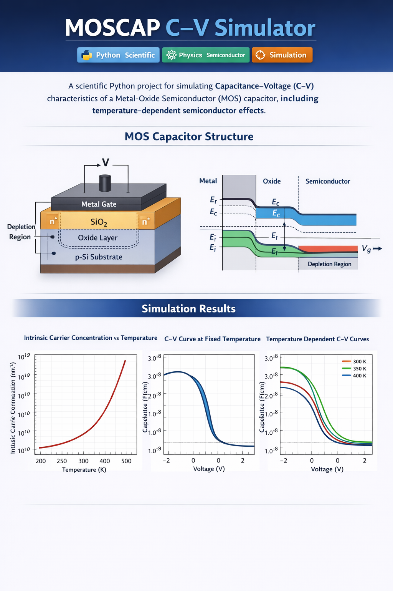

---

# Scientific Motivation

MOS capacitors are fundamental structures in semiconductor technology and form the electrostatic foundation of:

- MOSFETs
- CMOS integrated circuits
- High-voltage semiconductor devices
- Semiconductor sensors
- Nanoelectronic systems

Understanding MOS C–V behavior is essential for:

- Doping profile extraction
- Oxide characterization
- Interface analysis
- Threshold voltage studies
- Semiconductor process optimization
- Device reliability analysis

This project implements physically meaningful MOS electrostatics while maintaining numerical simplicity and modular software structure.

---

# Features

## Semiconductor Physics

- Oxide capacitance (Cox) modeling
- Semiconductor depletion capacitance
- Flat-band voltage calculations
- Fermi potential calculations
- Strong inversion condition estimation
- Temperature-dependent intrinsic carrier concentration
- Regime-aware MOS electrostatics
  - Accumulation
  - Depletion
  - Strong inversion
- Gate-voltage-based MOS analysis

## Numerical Physics 

- Finite-difference Poisson solver
- Numerical electrostatic potential calculation
- Iterative relaxation method
- Self-consistent charge–potential coupling
- Self-consistent MOS C–V simulation
- Electric field extraction
- Charge density integration
- MOS regime classification
- Numerical convergence analysis
- Analytical vs numerical validation
- Relative error analysis

## Scientific Computing

- NumPy-based numerical framework
- Modular physics architecture
- Separation of physics and visualization layers
- Reproducible simulations
- Extensible simulation framework

## Software Engineering

- Objectively tested physics functions
- Automated unit testing with PyTest
- Documented scientific modules
- Research-oriented repository structure
- Continuous integration ready
- 36 automated tests covering physics and numerical modules

## Visualization

The simulator generates:

- Intrinsic carrier concentration plots
- MOS C–V characteristics
- Temperature-dependent C–V curves
- Oxide-thickness sweep studies
- Gate-voltage-based simulations
- Numerical Poisson solutions
- Analytical vs numerical comparisons
- Relative error analysis

---

# Recent Improvements

Recent development work added:

- Self-consistent Poisson–Boltzmann MOS solver
- MOS regime classification
- Analytical vs numerical comparison tools
- Error-analysis framework
- Doping sweep simulations
- Expanded automated test suite
- Additional validation and edge-case testing

---

# Project Structure

```text
moscap-cv-simulator/
│
├── src/
│   └── physics/
│       ├── constants.py
│       ├── semiconductor.py
│       ├── moscap.py
│       ├── simulation.py
│       ├── poisson.py
│       ├── electrostatics.py
│       ├── device.py
│       └── self_consistent_mos.py
│
├── examples/
│   ├── plot_intrinsic_carrier.py
│   ├── cv_simulations.py
│   ├── cv_temperature.py
│   ├── tox_sweep.py
│   ├── doping_sweep.py
│   ├── gate_voltage_cv.py
│   ├── theory_comparison.py
│   ├── numerical_error_analysis.py
│   └── poisson_demo.py
│
├── tests/
│   ├── test_moscap.py
│   ├── test_cv.py
│   ├── test_semiconductor.py
│   ├── test_poisson.py
│   ├── test_simulation.py
│   └── test_advanced_physics.py
│
├── figures/
├── requirements.txt
├── README.md
└── .github/
    └── workflows/
        └── python-tests.yml
```

---

# Installation

## Clone Repository

```bash
git clone https://github.com/AminaAmeer01/moscap-cv-simulator.git

cd moscap-cv-simulator
```

## Create Virtual Environment

```bash
python -m venv venv
```

## Activate Environment

### Linux / macOS

```bash
source venv/bin/activate
```

### Windows

```bash
venv\Scripts\activate
```

## Install Dependencies

```bash
pip install -r requirements.txt
```

---

# How to Run

## Intrinsic Carrier Concentration

```bash
python examples/plot_intrinsic_carrier.py
```

## Basic MOS C–V Simulation

```bash
python examples/cv_simulations.py
```

## Temperature-Dependent C–V Curves

```bash
python examples/cv_temperature.py
```

## Oxide Thickness Sweep

```bash
python examples/tox_sweep.py
```

## Doping Dependence Sweep

```bash
python examples/doping_sweep.py
```

## Gate Voltage Based C–V Simulation

```bash
python examples/gate_voltage_cv.py
```

## Theory Comparison

```bash
python examples/theory_comparison.py
```

## Numerical Error Analysis

```bash
python examples/numerical_error_analysis.py
```

## Poisson Solver Demonstration

```bash
python examples/poisson_demo.py
```

---

# Running Tests

The automated test suite validates:

- Semiconductor physics calculations
- MOS capacitance models
- Poisson solver behavior
- Self-consistent MOS simulations
- Numerical stability
- Error-analysis workflows

```bash
pytest
```

## Expected Output

```text
36 passed
```

---

# Physics Background

The simulator models MOS capacitor electrostatics using standard semiconductor device theory.
The analytical model is based on oxide capacitance, depletion-layer electrostatics, and quasi-static MOS C–V theory, while the numerical framework employs finite-difference solutions of Poisson's equation and self-consistent charge–potential iterations.
---

# Oxide Capacitance

$$
C_{ox} =
\frac{\varepsilon_{ox} A}{t_{ox}}
$$

where:

- $\varepsilon_{ox}$ — oxide permittivity
- $A$ — capacitor area
- $t_{ox}$ — oxide thickness

---

# Semiconductor Depletion Width

$$
W =
\sqrt{
\frac{
2 \varepsilon_s \phi_s
}{
q N_A
}
}
$$

where:

- $\varepsilon_s$ — semiconductor permittivity
- $\phi_s$ — surface potential
- $q$ — elementary charge
- $N_A$ — acceptor concentration

---

# Semiconductor Capacitance

$$
C_s =
\frac{
\varepsilon_s A
}{
W
}
$$

---

# Total MOS Capacitance

The total MOS capacitance is modeled using the series combination:

$$
\frac{1}{C}
=
\frac{1}{C_{ox}}
+
\frac{1}{C_s}
$$

---

# Intrinsic Carrier Concentration

The temperature dependence of intrinsic carrier concentration is modeled as:

$$
n_i(T)
=
n_{i,300K}
\left(
\frac{T}{300}
\right)^{3/2}
\exp
\left[
-
\frac{E_g}{2k_B}
\left(
\frac{1}{T}
-
\frac{1}{300}
\right)
\right]
$$

where:

- $n_i$ — intrinsic carrier concentration
- $E_g$ — bandgap energy
- $k_B$ — Boltzmann constant
- $T$ — temperature

---

# Advanced MOS Modeling

In addition to depletion-based analytical modeling, the simulator implements a regime-aware MOS electrostatic model.

The implementation is provided in:

```text
src/physics/moscap.py
```

through the function:

```python
mos_capacitance_regime()
```

---

## Self-Consistent MOS Solver

Beyond analytical MOS modeling, the project includes a
self-consistent electrostatic solver.

The implementation combines:

- Charge density calculation
- Poisson equation solution
- Iterative convergence

This approach is commonly used in semiconductor device
simulation and TCAD software.

The implementation is provided in:

`src/physics/self_consistent_mos.py`

---

### Example Potential Profile

The project includes an iterative electrostatic solver
that computes semiconductor potential using repeated
Poisson updates until convergence.

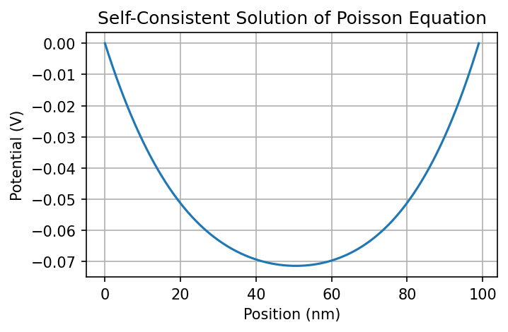

---

## MOS Physical Regimes

### Accumulation

$$
\phi_s < 0
$$

Majority carriers accumulate near the oxide interface and the capacitance approaches the oxide capacitance:

$$
C \approx C_{ox}
$$

---

### Depletion

$$
0 < \phi_s < 2\phi_F
$$

A depletion region forms inside the semiconductor and capacitance decreases as depletion width increases.

---

### Strong Inversion

$$
\phi_s > 2\phi_F
$$

Minority carriers dominate near the interface.

Under low-frequency approximation:

$$
C \approx C_{ox}
$$

---

# Numerical Poisson Solver

The project includes a finite-difference implementation of the one-dimensional Poisson equation for semiconductor electrostatics.

---

# Governing Equation

$$
\frac{d^2 \phi}{dx^2}
=
-\frac{\rho(x)}{\varepsilon}
$$

where:

- $\phi$ — electrostatic potential
- $\rho(x)$ — charge density distribution
- $\varepsilon$ — permittivity

---

# Numerical Method

The Poisson equation is discretized using finite differences:

$$
\phi_i
=
\frac{1}{2}
\left(
\phi_{i+1}
+
\phi_{i-1}
+
\frac{
\Delta x^2 \rho_i
}{
\varepsilon
}
\right)
$$

The electrostatic potential is solved iteratively until convergence.

---
# Self-Consistent Electrostatic Solver

The simulator additionally implements a nonlinear self-consistent electrostatic framework.

Carrier densities are modeled using Boltzmann statistics:

$$
n = n_i e^{\phi/V_T}
$$

$$
p = n_i e^{-\phi/V_T}
$$

The semiconductor charge density is computed as:

$$
\rho = q(p - n - N_A)
$$

where:

- $\rho$ = charge density
- $q$ = elementary charge
- $p$ = hole concentration
- $n$ = electron concentration
- $N_A$ = acceptor concentration

with thermal voltage:

$$
V_T = \frac{k_B T}{q}
$$

The charge density is coupled to the Poisson equation and solved iteratively until electrostatic self-consistency is achieved.

This approach forms the basis of many semiconductor device simulators and TCAD frameworks.

---

# Theory Validation

The simulator compares numerical MOS capacitance against analytical semiconductor theory.

The comparison validates:

- Depletion-region behavior
- Numerical stability
- Electrostatic consistency
- Physical correctness of capacitance evolution

The project includes:

- Analytical vs numerical comparison plots
- Relative error analysis
- Quantitative error metrics
- RMS error evaluation

---

# Simulation Results

## Intrinsic Carrier Concentration

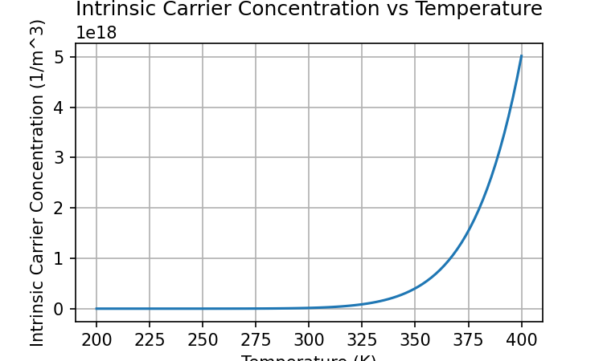

---

## MOS C–V Curve

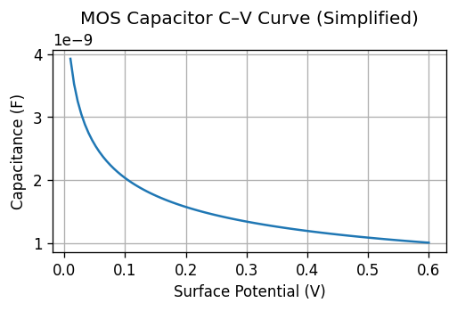

---

## Temperature-Dependent C–V

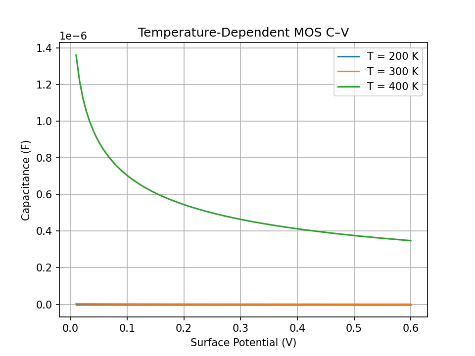

---

## Oxide Thickness Sweep

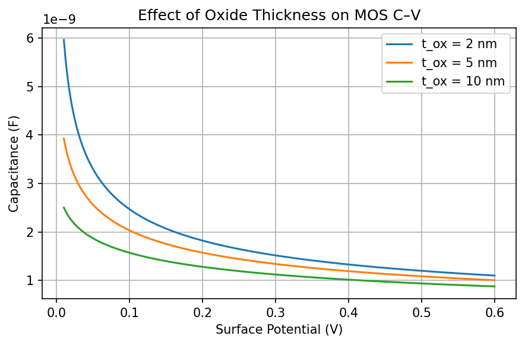

---
## Doping Sweep

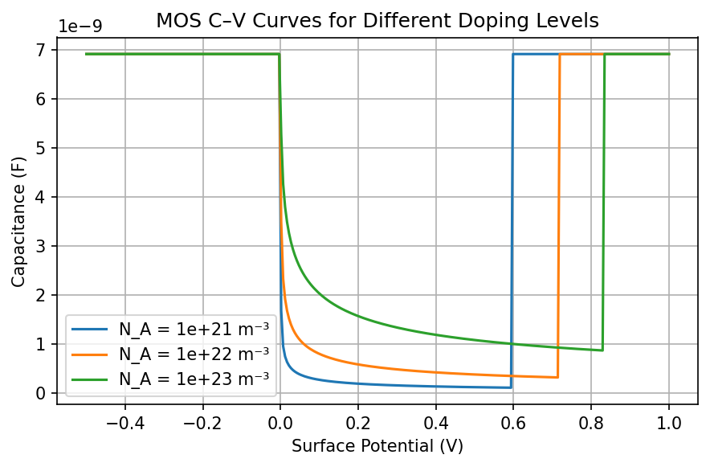

---
## Self-Consistent MOS Potential


---

## Poisson Solver

The project includes a finite-difference solution of the one-dimensional Poisson equation for electrostatic potential calculations.

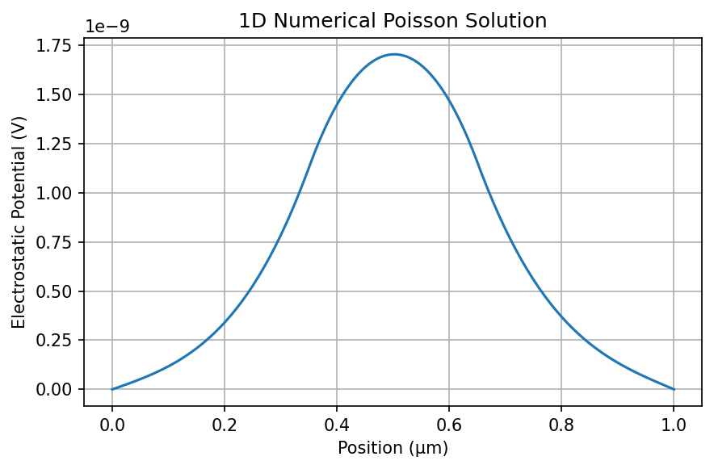

---

## Gate Voltage Based Simulation

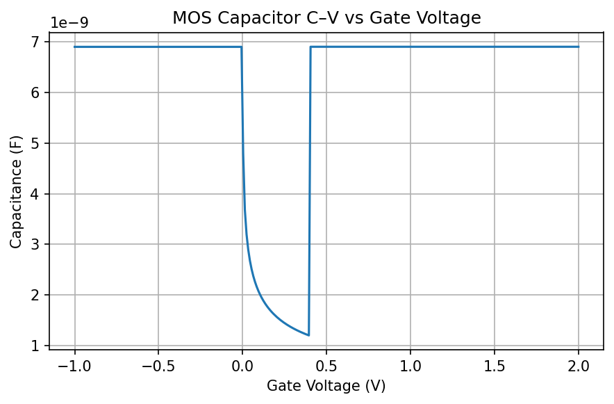

---

## Analytical vs Numerical Comparison

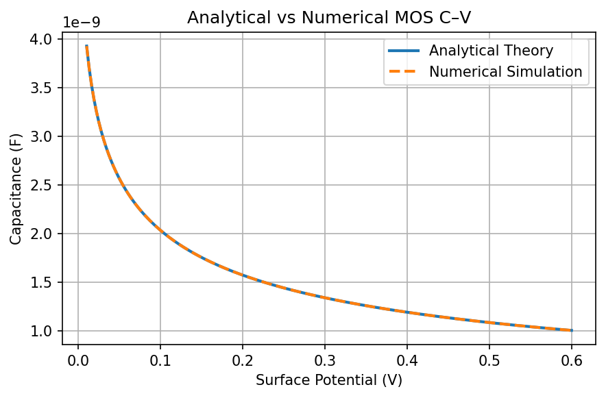

---

## Relative Error Analysis

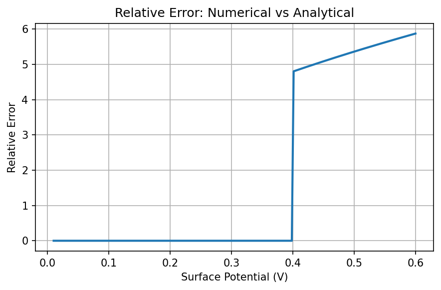

---

# Numerical Implementation

The simulator uses:

- NumPy for numerical computation
- Matplotlib for scientific visualization
- Finite-difference electrostatic discretization
- Iterative relaxation methods
- Modular scientific software design

The regime-aware MOS behavior is implemented in:

```python
mos_capacitance_regime()
```

located in:

```text
src/physics/moscap.py
```

---

# Design Principles

- Modular architecture
- Clear separation of physics and plotting
- Reproducible scientific computation
- Extensible simulation framework
- Unit-tested scientific functions
- Minimal external dependencies

---

# Model Assumptions

- Ideal MOS capacitor
- Uniform doping
- No interface traps
- No oxide charge
- Quasi-static approximation
- Simplified inversion modeling
- One-dimensional electrostatics

---

# Limitations

Although physically meaningful, the simulator still uses several simplifying assumptions:

- No full drift-diffusion transport
- No quantum confinement
- No frequency-dependent high-frequency C–V
- No interface trap dynamics
- No experimental parameter extraction
- No full TCAD mesh-based discretization

---

# Future Extensions

Potential future developments include:

- High-frequency MOS C–V modeling
- Interface trap capacitance
- Quantum corrections
- Experimental data fitting
- Drift-diffusion transport
- Full nonlinear Poisson–Boltzmann solver
- 2D semiconductor electrostatics
- TCAD-level numerical framework

---

# Reproducibility

All figures and numerical results can be reproduced directly using the scripts provided in the `examples/` directory.

The project is designed to support transparent and reproducible computational physics workflows.

---

# Author

Syeda Amina Ameer

M.Sc. Physics (Material Physics and Nanoscience)

University of Bologna

Research interests:
- Semiconductor device physics
- Computational physics
- Numerical modeling
- Nanoscience